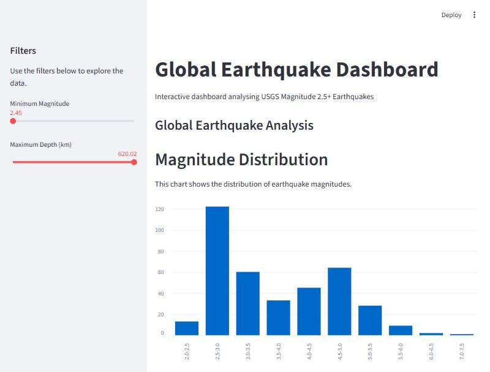

# Global Earthquake Dashboard

An interactive Streamlit dashboard for exploring global seismic activity, built on the
USGS Magnitude 2.5+ weekly feed. Filter by magnitude and depth and the map, charts and
data table all update together.



## The data

| | |
|---|---|
| Source | [USGS Earthquake Hazards Program](https://earthquake.usgs.gov/earthquakes/feed/) — M2.5+ weekly feed |
| Records | 377 earthquakes |
| Period | 13–20 April 2026 |
| Columns | 22 |
| Magnitude range | 2.45 – 7.4 |
| Depth range | −1.54 – 620.02 km |
| Largest event | M7.4, 100 km ENE of Miyako, Japan |
| Deepest event | 620.0 km, 168 km NE of Sola, Vanuatu |

## What the data actually shows

**1. The dataset measures sensor coverage, not seismic activity.**
Alaska accounts for **23.1%** of all 377 records — but its median magnitude is **2.8**,
against **3.91** everywhere else. Alaska is not more seismically active than the rest of
the world; it has a dense local sensor network that detects small events which would go
unrecorded elsewhere. Any ranking of "most earthquake-prone regions" built from this feed
would be measuring instrumentation, not geology.

**2. The magnitude distribution is bimodal, and that is an artefact.**
Counts peak at M2.5–3.0 (122 events), fall to 33 at M3.5–4.0, then rise again to 64 at
M4.5–5.0. Real earthquake magnitudes follow the Gutenberg–Richter law — smaller events are
strictly more frequent — so a second peak is not physical. It is the two detection regimes
overlapping: dense regional networks catching small local events, and the global network
catching everything above roughly M4.5.

**3. The feed does not respect its own threshold.**
Thirteen records fall **below M2.5** in a feed labelled "M2.5+", the smallest at M2.45.
Minor, but it means the stated inclusion rule cannot be assumed when filtering.

**4. Two events have negative depth**, the lowest at −1.54 km. These are not errors: USGS
depths are measured from a reference datum, so an event above it is recorded as negative.
Any depth filter written as `depth >= 0` would silently drop them.

**5. Depth is heavily skewed.** 307 of 377 events (81%) are shallower than 70 km; only 11
are deeper than 300 km.

## Running it

```bash
pip install -r requirements.txt
streamlit run app.py
```

Opens at `http://localhost:8501`.

## Built with

Python · Streamlit · pandas

## Limitations

- A single 7-day snapshot. No seasonal or long-term trend can be drawn from it.
- The CSV is committed to the repo rather than pulled live, so the dashboard shows a fixed
  window. Pointing it at the USGS feed URL would make it live.
- Region grouping is parsed from the free-text `place` field, which is not a controlled
  vocabulary.
